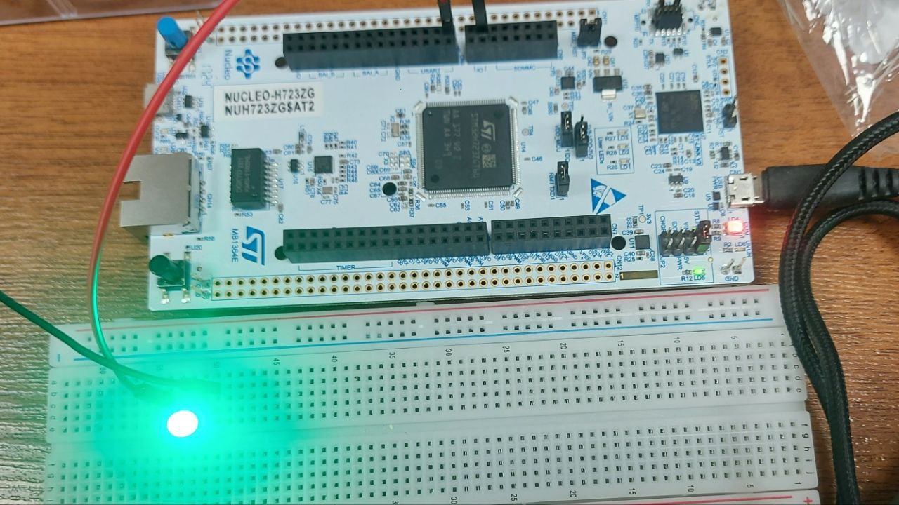
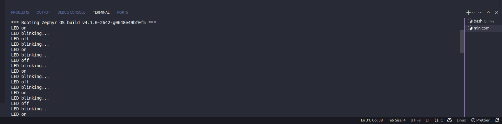

# Zephyr LED Blinking Application 🚀

## Overview 📝
This application demonstrates a basic Zephyr RTOS program that blinks an LED on the target board. It serves as an introductory exercise to familiarize with Zephyr’s GPIO API, device tree configuration, and build/flash process. 

There are different ways to get access to a component like GPIO, SPI, UART, or anything else.  
One way is getting the related device directly from the devicetree.  
This way is somewhat uncommon and is rarely used in most examples found on the Internet, mostly due to these reasons:

1. **Lack of Bundled Configuration Data**  
  Direct device retrieval gives you only the device pointer, without any associated configuration such as pins, flags, or other properties defined in the devicetree.  
  This forces you to manually fetch and manage related parameters separately, increasing boilerplate and risk of errors.

2. **Less Type Safety and Code Clarity**  
  Using just a device pointer can lead to scattered code where device configuration is handled separately from device access.  
  `dt_spec` bundles device and configuration into a single, strongly typed structure (e.g., `gpio_dt_spec`), improving readability and reducing mistakes.

3. **More Error-Prone for Complex Bindings**  
  For devices that require multiple devicetree properties (e.g., GPIO pins plus flags), direct device retrieval does not help manage these cohesively.  
  `dt_spec` macros initialize all relevant fields at compile time, preventing runtime misconfiguration.

4. **Manual Handling of Phandles and Indices**  
  When devices are referenced via phandles or arrays in the devicetree, direct device retrieval requires manual indexing and property extraction.  
  `dt_spec` macros abstract this complexity, making code simpler and less error-prone.

A device can be taken directly using the `device_get_binding` function or the `DEVICE_DT_GET` macro (using the macro is recommended).  

**Note:**  
- There are definitely other functions or macros to get a device directly.  
- The `device_get_binding` function looks for the property of the label with a matched value (not the node label).  
  So you should add a label property to the node in the devicetree by using an overlay, as seen in the `app.overlay` file.

Continuing the previous topic (get access to a component like GPIO or ...), another way is using `_dt_spec`.  
The word "spec" stands for specification, and it refers to a struct that encapsulates all the necessary information about a device or peripheral (like device pointers and configuration) in one place.  

You can use `*_DT_SPEC_GET` functions to get a `_dt_spec` structure. First, we need a devicetree node identifier. A lot of macros could make that possible, such as:  
1. `DT_ALIAS(alias)`  
2. `DT_NODELABEL(label)`  
3. `DT_CHOSEN(chosen)`  
4. `DT_PATH(soc, pin-controller@58020000, gpio@58020000)` // example path


## Implementation Details 🛠️
- The pin is intended to toggle OFF&ON is PA3
- Configured the LED pin using Zephyr’s device tree alias `led3`
- In blinky application, a bind is created to get the access to the `gpioa` device directly.
- To use the device_get_binding function, it's needed to add a label property for gpioe (see app.overlay).
- In blinky-v2 application, dt_spec functions are used to get access to the pin (not the bus device which means the gpioe)
- all possible ways to pass a node identifier to de_spec_get function are in the main.c
- Used GPIO API to:
  - Get device binding for the LED GPIO controller
  - Configure the LED pin as output
  - Toggle the LED state in an infinite loop with a delay (`k_sleep`)
- LED state is sent to the console via UART using prink function
- Source code primarily in `blinky/src/main.c` and `blinky-v2/src/main.c`

## Build & Flash Instructions ⚙️
1. Navigate to the application directory.
2. Build the project for your board (replace `your_board` with your board name):
``` bash
west build -b your_board
```
3. Flash the firmware to the board:
``` bash
west flash
```
4. The LED should start blinking immediately after flashing.

## Test Procedure 🧪
- Observed the LED behavior on the board.  
- Tested changing the blink interval by modifying `#define SLEEP_TIME` in `src/main.c` (e.g., from 1000 ms to 100 ms) and rebuilding/flashing.
- Verified that the LED blinked faster with the reduced delay.
- Observed LED state via UART/console output.

## Test Results 📊
- The LED blinked at a steady 1-second interval as expected.  
  
- After modifying `SLEEP_TIME` to 100 ms, the LED blinked visibly faster.
- Observed results via UART/console output.  
  


## Lessons Learned / Next Steps 🎯
- Gained hands-on experience with Zephyr’s device tree and GPIO API.
- Understood the build and flash workflow using `west`.
- Next steps include exploring interrupts, multi-threading, and integrating other peripherals.

## References 📚
- [Zephyr Blinky Sample Documentation](https://docs.zephyrproject.org/latest/samples/basic/blinky/README.html)
- [Adafruit Guide: Blinking an LED with Zephyr RTOS](https://learn.adafruit.com/blinking-led-with-zephyr-rtos)
- [Zephyr Project Official Website](https://www.zephyrproject.org/)


