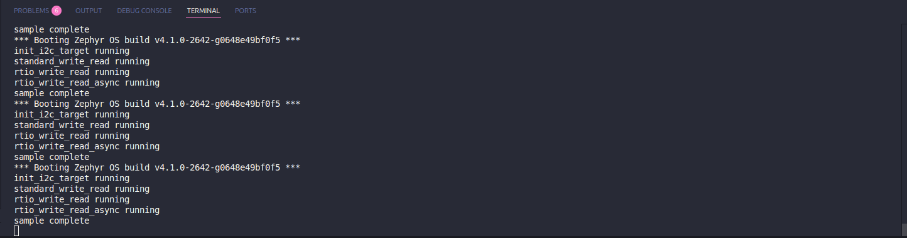
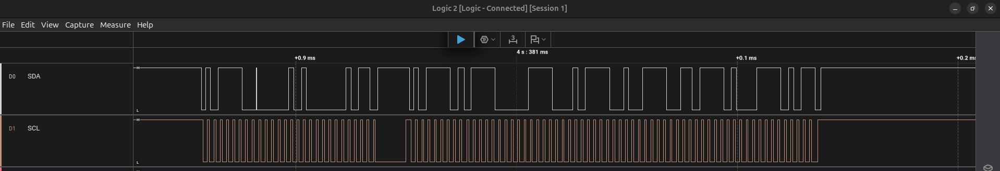

# Zephyr I2C Test Application 
## Overview 📝
This application demonstrates the use of the I2C peripheral on an STM32 board running Zephyr RTOS by performing a loopback test. The objective was to configure the I2C interface, send data, and verify correct reception-either by using a physical loopback (connecting SDA/SCL to a compatible device or self-addressed slave mode) or by communicating with a known slave device that echoes data. This validates the I2C driver configuration and hardware wiring.

This application demonstrates I2C communication between two I2C peripherals on the stm32h723zg mirco, showcasing both standard synchronous I2C APIs and the asynchronous RTIO (Real-Time Input/Output) framework. The sample implements a simple I2C target device, performs write/read transactions using both APIs, and validates data integrity after each operation.

## Implementation Details 🛠️
- Configure the i2c1 and i2c2 peripheral in the device tree, enabling the appropriate I2C instance and assigning correct pins for SDA and SCL[2][4][8].
- Application code:
  - Obtaine the I2C device binding using Zephyr’s device API.
  - Set up I2C configuration structure specifying parameters such as bitrate (e.g., 100 kHz, 400 kHz)[2][3].
  - Prepared a transmit buffer with a known data pattern (e.g., `{0xA5, 0x5A, 0xFF}`).
  - Use Zephyr’s `i2c_write_read()` or `i2c_transfer()` API to send and receive data[2][3].
  - Compare the received buffer to the transmitted data to verify correct loopback or echo operation.
  - Provide UART or console output to display test results.

## Build & Flash Instructions ⚙️
1. Connect the I2C buses together on the board (for nucleo_h723zg would be pb8<->pb10 and pb9<->pb11)
2. Build the application:
``` bash
west build -b your_board
```
3. Flash the firmware to the board:
``` bash
west flash
```
4. Open a serial terminal to view test output.

## Test Procedure 🧪
- On boot, the application sent a known data pattern over I2C and attempted to read the response.
- if received data buffer is not matched to the transmitted buffer, the app send a `failed` message for us via UART/Console.
- Repeate the test with different data patterns and I2C configurations (e.g., bitrate).
- Observe results via UART/console output.
- Observed SDA and SCL signal via logic analyzer


## Test Results 📊
- Changing the transmit data resulted in corresponding changes in the received data, confirming proper loopback/echo.
- No errors or mismatches were observed in the test cases.  



- The I2C peripheral and Zephyr driver operated reliably in the tested configurations.
- Observed SDA and SCL signal via logic analyzer  



## References 📚
- [Zephyr STM32 I2C V2 Binding Documentation][2]
- [Zephyr STM32 I2C V1 Binding Documentation][4]
- [Zephyr I2C Driver Source (STM32)][1][3]
- [ST Wiki: I2C Device Tree Configuration][8]

[1]: https://github.com/zephyrproject-rtos/zephyr/blob/main/drivers/i2c/i2c_ll_stm32.c  
[2]: https://docs.zephyrproject.org/latest/build/dts/api/bindings/i2c/st,stm32-i2c-v2.html  
[3]: https://github.com/zephyrproject-rtos/zephyr/blob/master/drivers/i2c/i2c_ll_stm32_v2.c  
[4]: https://docs.zephyrproject.org/latest/build/dts/api/bindings/i2c/st,stm32-i2c-v1.html  
[8]: https://wiki.st.com/stm32mpu/wiki/I2C_device_tree_configuration  
