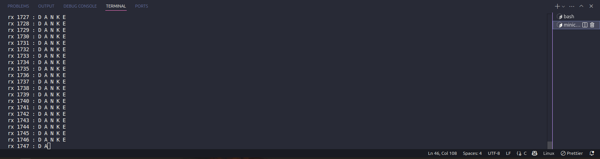
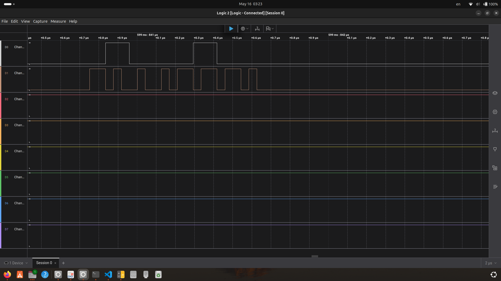

# Zephyr SPI Loopback Application 🔄

## Overview 📝
This application demonstrates the use of the SPI peripheral on an STM32 board running Zephyr RTOS by performing a hardware loopback test. The goal was to configure the SPI interface, send data, and verify correct reception by physically connecting the MOSI and MISO pins, allowing transmitted data to be immediately received back. 

## Implementation Details 🛠️
- Configured the SPI peripheral in the device tree, enabling the appropriate SPI instance and assigning correct pins for SCK, MOSI, and MISO[1] [2] [5] [7].  
- ⚠️ We failed to write a driver to use SPI and had to use the SPI bus directly as a device binding.
- Application code:
  - Obtained the SPI device binding using Zephyr’s device API.
  - Set up an SPI configuration structure specifying parameters such as frequency, mode, and word size[2] [7].
  - Prepared a transmit buffer with a known data pattern (e.g., "Hello, SPI!" or a fixed byte sequence).
  - Set up a receive buffer of equal length.
  - Used Zephyr’s `spi_transceive()` or `spi_write()`/`spi_read()` API to send and receive data in full-duplex mode[2] [5] [7].
  - Compared the received buffer to the transmitted data to verify correct loopback operation.
- Provided UART or console output to display test results.
``` bash
minicom -D /dev/ttyACM0
```

## Build & Flash Instructions ⚙️
1. Ensure the SPI peripheral and pins are correctly configured in the device tree overlay (see Zephyr documentation for STM32 SPI binding)[1].
2. Connect MOSI and MISO pins on the board for hardware loopback.
3. Build the application:
``` bash
west build -b your_board
```
4. Flash the firmware to the board:
``` bash
west flash
```
5. Open a serial terminal to view test output.

## Test Procedure 🧪
- Connected MOSI and MISO pins on the STM32 board.
- On boot, the application sent a known data pattern over SPI and attempted to read the response.
- Compared the received data buffer to the transmitted buffer.
- Repeated the test with different data patterns and SPI configurations (e.g., clock speed, mode).
- Observed results via UART/console output.
- Observed the data pattern using a logic analyser captured from the board.

## Test Results 📊
- When MOSI and MISO were connected, the received data matched the transmitted data exactly for all tested patterns and configurations.  



- Changing the transmit data resulted in corresponding changes in the received data, confirming proper loopback.
- No errors or mismatches were observed in the test cases.
- The SPI peripheral and Zephyr driver operated reliably in loopback mode.
- ⚠️ We falied to write an overlay to set a specefic clock rate for spi 
- The MOSI and SCK output signals were observed for a short period of time by the logic analyzer.  




## References 📚
- [Zephyr STM32 SPI Binding Documentation][1]
- [Basic SPI on STM32 with Zephyr - GitHub Gist][2]
- [Zephyr OS: STM32 SPI Transceive Example][5]
- [Stack Overflow: Using Zephyr SPI Driver Directly][7]

[1]: https://docs.zephyrproject.org/latest/build/dts/api/bindings/spi/st,stm32-spi.html
[2]: https://gist.github.com/disposedtrolley/f0edbef0e65dbd7b56207e4ffc35c8d1
[5]: https://dayjaby.wordpress.com/2021/06/12/zephyr-os-stm32-spi-transceive-example/
[7]: https://stackoverflow.com/questions/67962637/how-to-use-zephry-spi-driver-directly


