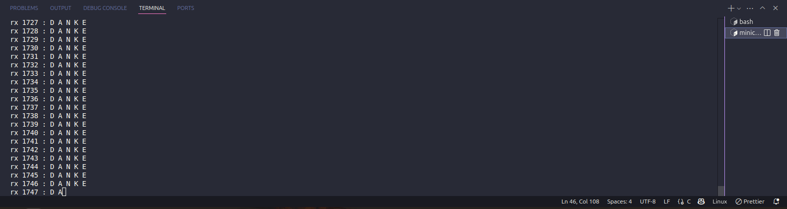
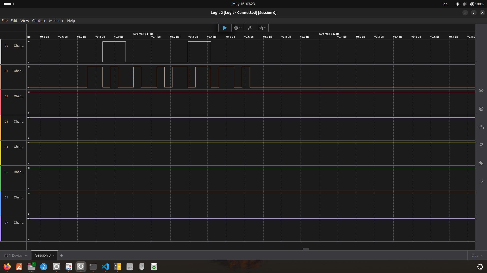

# Zephyr SPI Loopback Test Application 🔄

## Overview 📝
This application demonstrates the use of the SPI peripheral on an STM32 board running Zephyr RTOS by performing a hardware loopback test. The goal was to configure the SPI interface, send data, and verify correct reception by physically connecting the MOSI and MISO pins, allowing transmitted data to be immediately received back. 

## Implementation Details 🛠️
- Configure the SPI peripheral in the device tree, enabling the appropriate SPI instance and assigning correct pins for SCK, MOSI, and MISO[1] [2] [5] [7].  
- ⚠️ We failed to write a driver to use SPI and had to use the SPI bus directly as a device binding.
- Application code:
  - Obtaine the SPI device binding directly using Zephyr’s device API.
  - Set up an SPI configuration structure specifying parameters such as frequency, mode, and word size[2] [7].
  - Prepare a transmit buffer with a known data pattern (e.g., "DANKE" (Thank you in German :D) or a fixed byte sequence).
  - Set up a receive buffer of equal length.
  - Used Zephyr’s `spi_transceive()` or `spi_write()`/`spi_read()` API to send and receive data in full-duplex mode[2] [5] [7].
  - Compare the received buffer to the transmitted data to verify correct loopback operation.
- Provide UART or console output to display test results.
``` bash
minicom -D /dev/ttyACM0
```

## Build & Flash Instructions ⚙️
1. Ensure the SPI peripheral and pins are correctly configured in the device tree overlay (see Zephyr documentation for STM32 SPI binding)[1].
2. Connect MOSI and MISO pins on the board for hardware loopback.
3. Build the application:
``` bash
west build -b your_board
```
4. Flash the firmware to the board:
``` bash
west flash
```
5. Open a serial terminal to view test output.

## Test Procedure 🧪
- MOSI and MISO pins are connected together on the STM32 board.
- Compare the received data buffer to the transmitted buffer.
- Repeate the test with different data patterns and SPI configurations (e.g., clock speed, mode).
- Observe results via UART/console output.
- Observe the data pattern using a logic analyser captured from the board.

## Test Results 📊
- When MOSI and MISO were connected, the received data matched the transmitted data exactly for all tested patterns and configurations.  



- The MOSI and SCK output signals were observed for a short period of time by the logic analyzer.  



- ⚠️ The SPI peripheral and Zephyr driver do not operate reliably. I mean the widths of pulses in SCK signal are not equal. 
- ⚠️ We falied to write an overlay to set a specefic clock rate for spi (maybe **writing an overlay** is not the correct way at all).


## References 📚
- [Zephyr STM32 SPI Binding Documentation][1]
- [Basic SPI on STM32 with Zephyr - GitHub Gist][2]
- [Zephyr OS: STM32 SPI Transceive Example][5]
- [Stack Overflow: Using Zephyr SPI Driver Directly][7]

[1]: https://docs.zephyrproject.org/latest/build/dts/api/bindings/spi/st,stm32-spi.html
[2]: https://gist.github.com/disposedtrolley/f0edbef0e65dbd7b56207e4ffc35c8d1
[5]: https://dayjaby.wordpress.com/2021/06/12/zephyr-os-stm32-spi-transceive-example/
[7]: https://stackoverflow.com/questions/67962637/how-to-use-zephry-spi-driver-directly


