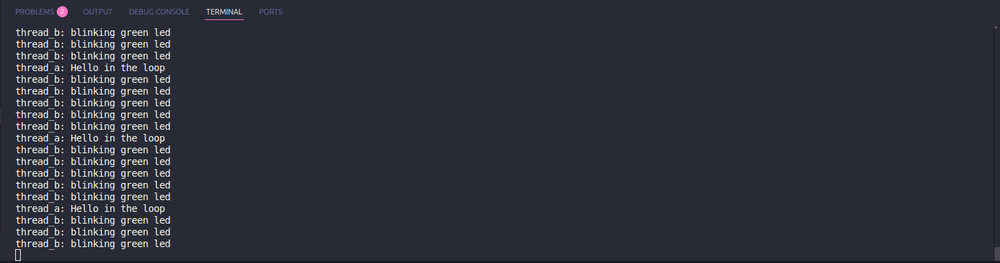

# Zephyr Threading Test Application 🧵

## Overview 📝
This application demonstrates the use of threading (multitasking) in Zephyr RTOS on an STM32 board. The goal was to create multiple threads, assign them different priorities, and observe their concurrent execution using simple tasks such as toggling LEDs or printing messages over UART.

## Implementation Details 🛠️
- Define two using Zephyr’s `K_THREAD_DEFINE()` macro or by manually creating thread stacks and calling `k_thread_create()`[1][2].
- Each thread performed a simple task, such as:
  - ThreadA: Toggled an LED at a fixed interval.
  - ThreadB: Printed a message over UART at a different interval.
- Used `k_sleep()` to control timing within each thread.
- Main code organized in `src/main.c`, with thread entry functions defined as static functions.

## Build & Flash Instructions ⚙️
1. Ensure the device tree is properly configured for any peripherals used (e.g., LED, UART).
2. Build the project:
``` bash
west build -b your_board
```
3. Flash the firmware to the board:
``` bash
west flash
```
4. Open a serial terminal to observe UART output (if used).

## Test Procedure 🧪
- Observe the behavior of the LEDs and/or UART output.
- Verifie that each thread performed its task at the expected interval.
- Change thread priorities to observe any changes in execution order or timing.

## Test Results 📊
- Multiple threads executed concurrently as expected.
- LED toggling and UART message printing occurred at their respective intervals.



## References 📚
- [Zephyr Kernel Thread API Documentation][1]
- [Zephyr Threading Example (Official Sample)][2]
- [Zephyr Synchronization Primitives][3]
- [Zephyr RTOS Concepts Guide][4]

[1]: https://docs.zephyrproject.org/latest/kernel/threads/index.html  
[2]: https://github.com/zephyrproject-rtos/zephyr/tree/main/samples/basic/threads  
[3]: https://docs.zephyrproject.org/latest/kernel/synchronization/index.html  
[4]: https://docs.zephyrproject.org/latest/kernel/index.html  
